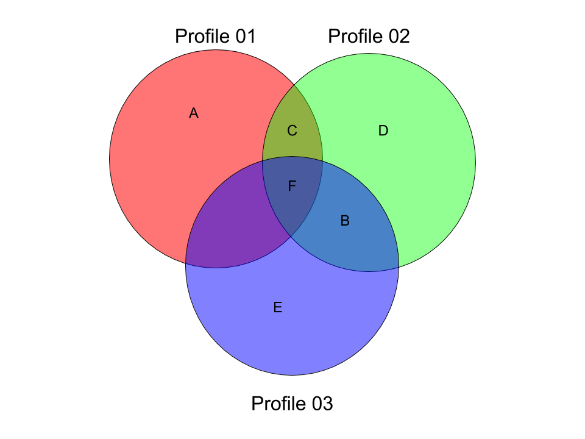

# WheresMyDuo Networking Processor Specification

## Target
The target of the Networking Processor Module is to process thousands of different WheresMyDuo Gaming Profiles per second and find the ones who are promising about social interaction based in pre-defined conditions.

## How
Since performance **is** a problem in this context, I analyzed benchmarks and paradigms and found the best way of dealing with this problem for now: Functional Programming.

### Why Functional Programming
Functional Programming is a programming paradigm inspired on **math**. The basic job of the WMD Networking Processor module is to compare different **data sets** and find relation between them, or in other words, **union theory**.

### Haskell
After analyzing some benchmarks of programming languages on common programming tasks, Haskell got my attention on some points:

- **Functional:** Haskell is a purely functional programming language, that means it fits perfectly with the initial condition of having process based on math theories.

- **Fast:** The most of the Haskell benchmarks shows that the Haskell performance is as good as as C's performance when compiled using GHC (Glasgow Haskell Compiler), and in some cases, it can be **even faster**.

- **Multicore:** Haskell has a fantastic Multicore implementation, thats one of the reasons why sometimes can be faster than C.

#### Benchmarks
All the benchmarks are done using an **Intel Core i5 8250u** CPU running on OpenSuse Tumbleweed (Linux 5.3.8-1 kernel) and the following compiler versions:
 - Java(TM) SE Runtime Environment (build 1.8.0_201-b09)
 - gcc (SUSE Linux) 9.2.1 20190903 [gcc-9-branch revision 275330]
 - Glasgow Haskell Compiler, Version 8.6.5, stage 2 booted by GHC version 8.4.3
 - GNU bash, version 5.0.11(1)-release (x86_64-suse-linux-gnu)


## How it Works
The main process of this module is given a raw GamingProfile on its input and a base GamingProfile to make the comparisons, it will compare the Tags and Hours fields.

### Input Layer
The gaming profile that the other ones will be compared with should be given via command line parameters:
```
    --tags 4390119fcd7f,6cd79977bcf8
    --hours 780
```

The list elements must be separated by a single ``,`` (comma).


The Gaming Profiles to be compared with the base one should be given via ``stdin``, separated by Unix Line Break (``/n``, byte ``0x0A``). ETX (``0x03``) means that there is no more profiles to input.

The input data must follow the **Gaming Profile Model**.

#### Hours Input Model

The Hours are formed by a 256 bit hexadecimal unsigned big-endian integer (16 hexadecimal characters). The state of the *n*th bit means that the *n*th hour of the week is marked as an available hour to the user to play. The left zeroes can be omitted.

E.g: ``40000F`` means that the hours ``0``, ``1``, ``2``, ``3`` and ``23`` are active.

#### Gaming Profile Model
```
<12 bytes profile ID>, [Tag 0 (12 bytes)] ... [Tag n], [Hour 0] ... [Hour 23]
```

Each argument should be separated by ``, `` (comma followed by blank space), and each element of the tag list should be separated by a single blank space.

E.g:
```507f1f77bcf8, 6cd799439011 72f81d9fcd7f, 40000F```

The example above means a profile with:
 - Id: ``507f1f77bcf8``
 - Tags: ``6cd799439011`` and ``72f81d9fcd7f``
 - Hours: ``0``, ``1``, ``2``, ``3`` and ``23``

 ### Processing Layer

 After the data is processed the networking processor would give a *social proximity ratio*, that consists in an 32bit signed integer that represents how close two Gaming Profile are in social levels. The higher its value is, the higher chance of those users being suggested to each other.

 #### Mathematical Concept

 The social proximity ratio is obtained with mainly **set theory** concepts, it is based in the amount of tags and hours that the users share between each other.

##### Tag Containment Ratio

The tag containment ratio is described by ``ƒ(A, B) := |A ∩ B| - |A ⊖ B|``. It represents the difference of the tags between two profiles.

 For instance, given three example of Gaming Profiles, being them:

 - Profile 01: ``{A, C, F}``
 - Profile 02: ``{B, C, D, F}``
 - Profile 03: ``{B, E, F}``

Looking into the sets of the tags:


Then, applying the formula:
- ``ƒ(Profile 01, Profile 02)`` = ``|{C, F}| - |{A, B, D}|`` = ``2 - 3 = -1``
- ``ƒ(Profile 01, Profile 03)`` = ``|{F}| - |{A, B, C, E}|`` = ``1 - 4 = -3``
- ``ƒ(Profile 02, Profile 03)`` = ``|{B, F}| - |{C, D, E}|`` = ``2 - 3 = -1``

Note that the arguments order is not important: ``ƒ(Profile 01, Profile 02) = ƒ(Profile 02, Profile 01)``

### Output Layer

After having all the data processed, the Output Layer will sort the results and write it to stdout in the following format:

``<PROFILE_ID> <SOCIAL_PROXIMITY_RATIO>\n``

Being ``<PROFILE_ID>`` the 12 bytes profile ID and ``<SOCIAL_PROXIMITY_RATIO>`` a 32 bits signed integer representing the social proximity ratio between the Gaming Profile being analyzed and the Gaming Profile identified by ``<PROFILE_ID>``.

At the end of the stream, an ETX (``0x03``) will be written to stdout. This means there is no more data to be written and the process is done.

#### Limiting

If the ``--limit`` command line argument is supplied, the results list the the Output Layer will output will be limited by the argument provided.

The argument for ``--limit`` **must** be a 32 bit signed integer equal or greater than zero.
